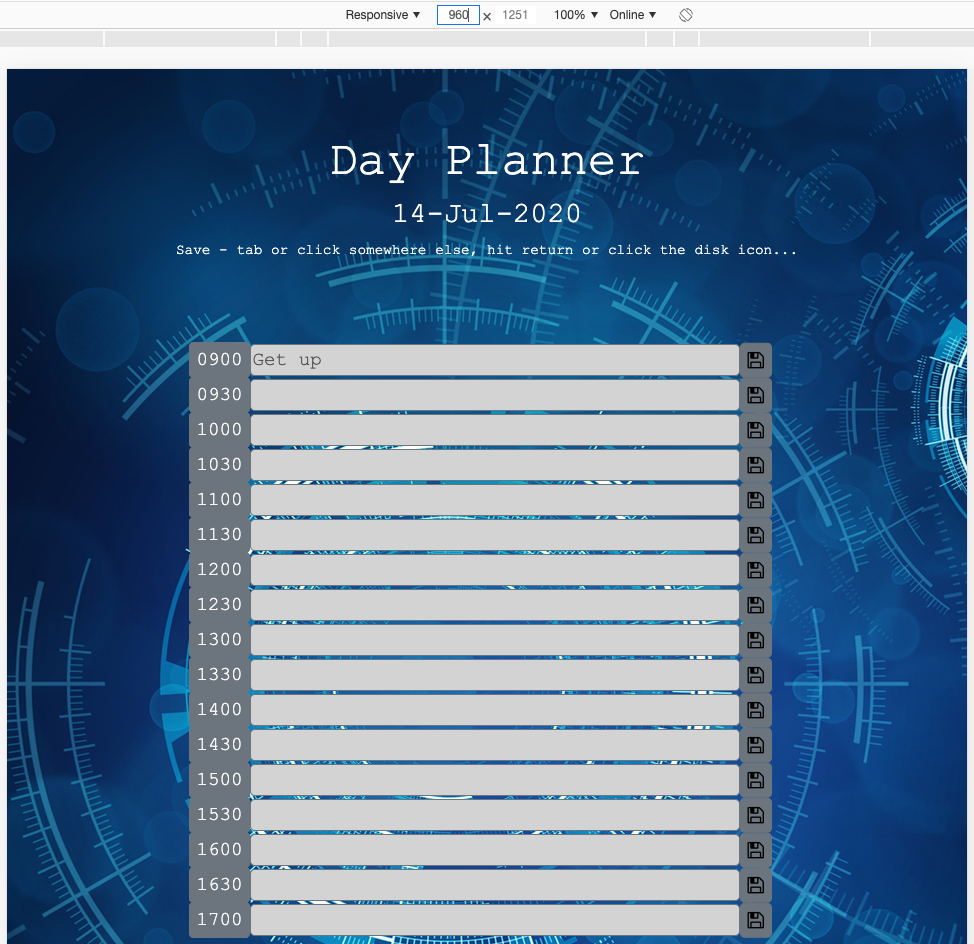
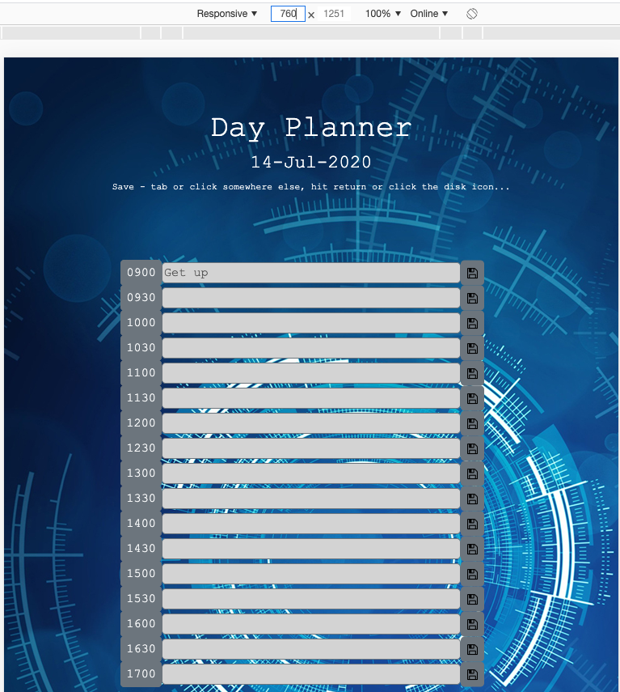
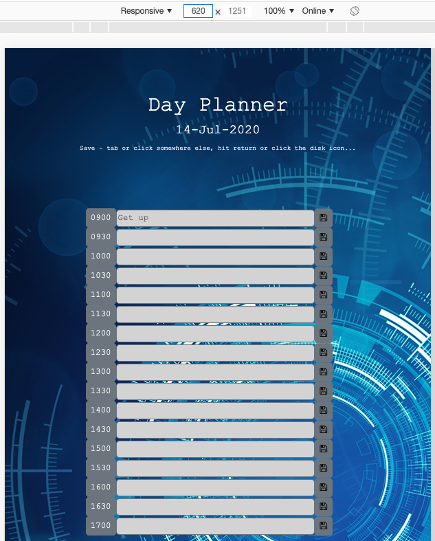

# dayplanner
Home Work #5 - Day Planner

This project was outlined such that we would create a single day planner for the current day.  There would be time blocks for each hour. I went beyond hourly and added half hour increments to the planner.  Each time block can have text stored in it to indicate plans/events for that time period.  Each time block will be color coded to indicated whether it's in the past, present or future.  Events can be saved by clicking on a save button and they persist.  I also added 2 additional listeners to the day planner - so that if you tab off of one of the input boxes or if you hit return - it also saves.

Below are screen shots of my Day Planner and various screen widths.

